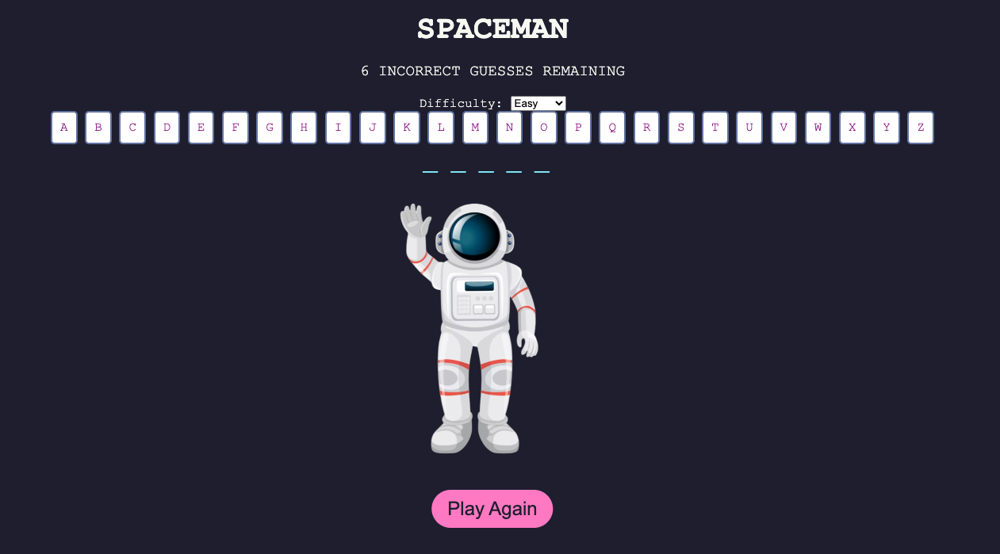

# SpaceMan

## Description
**Spaceman** is an interactive word-guessing game where players must uncover a hidden word, one letter at a time. The game begins with a string of blank spaces (pun intended), representing the hidden word. Players guess letters to fill in the blanks. For every correct guess, the corresponding letter appears in the word. However, for each incorrect guess, the Spaceman’s body vanishes, bringing him closer to the end. If the player guesses the full word before the the Spaceman is complety gone, they win. If the player makes too many wrong guesses, the Spaceman dissappears, signaling the player’s loss. After each game, players can either play again.
 

## MVP Objectives 

* As a player, I want to see the correct letters I have guessed displayed in their appropriate positions.
* As a player, I want my game to respond to my letter inputs, so I know if my guesses are correct or incorrect.
* As a player, I want to see which letters I have guessed incorrectly.
* As a player, I want to know when I have lost the game.
* As a player, I want to know when I have won the game.
* As a player, I want the ability to reset the game at any time.

## Other Objectives
* As a developer, I would like to the animation of the spaceman to disappear when the player loses.
* As a developer, I would like the animation to stay intact when the player wins.

## Technologies Used
* **HTML** for structuring the game elements.
* **CSS** for styling and animations to create an appealing interface.
* **JavaScript** for implementing the game logic and interactivity.

## Getting started 
[SpaceMan](https://dellolow.github.io/spaceman-project/)

## Approach Taken
To build **Spaceman**, I started by analyzing the game’s mechanics and breaking them down into smaller components. I played a few rounds of a similar word-guessing game to understand the critical features and their dependencies. From there, I outlined the major variables and functions required for functionality, such as handling user input, tracking guesses, and rendering game states.

